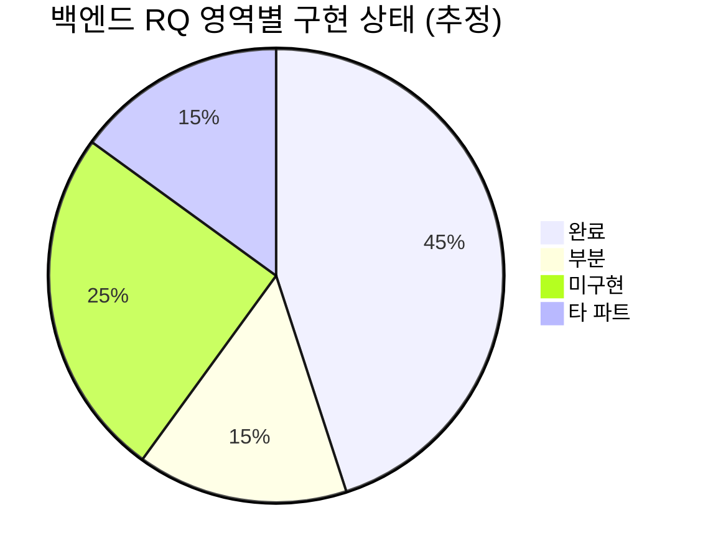

# VeriForensics 프로젝트 진행 상황

> **작성일:** 2026-06-17  
> **최종 갱신:** 2026-06-18  
> **기준:** `docs/requirements/source/` Excel · **영상(VIDEO)만** 지원

---

## 갱신 규칙 (팀 합의)

**주 1회** (스프린트 회의 전·후, 담당: BE 리드 또는 PM) 본 문서 상태를 맞춥니다.

| 주기 | 갱신 대상 | 하지 않음 |
| :--- | :--- | :--- |
| **매주 1회** | §1 한눈에 보기 · §2 영역별 표 · §8 P0/P1 · §9 파트별 요약 · **최종 갱신** 날짜 | §3 API 전체 목록 재작성 |
| **PR 머지 시** (선택) | §12 변경 이력 1줄 · §2 해당 RQ 행만 | §1 퍼센트 재계산 |
| **마일스톤·스프린트 종료** | §3 API 목록 · §6 RTM 교차검토 · §10 다음 스프린트 | — |

**매주 체크리스트 (5~10분)**

- [ ] 코드·`api/specification.md` Gap과 §2 상태 emoji 일치
- [ ] 완료된 P0/P1을 §8에서 ✅ 처리 또는 제거
- [ ] §12에 이번 주 주요 완료 1~3줄 추가
- [ ] 상단 **최종 갱신** 날짜 수정

**AI로 갱신할 때** (토큰 절약): `@docs/PROJECT_STATUS.md` 첨부 후  
「§1·§2·§8·§12와 최종 갱신 날짜만 업데이트. §3·§9 전체 재작성 금지」라고 지시.

개별 PR마다 전 문서를 다시 쓰지 않습니다. 상세 작업 기록은 PR 본문·Jira에 두고, 본 문서는 **팀 공용 현황판**만 유지합니다.

---

## 1. 한눈에 보기

| 구분 | 규모 | 진행 (본 레포 BE 기준) | 비고 |
| :--- | :---: | :---: | :--- |
| **요구사항 (RQ)** | 169건 | **약 55~60%** | source Excel 재추출 (2026-06-18) |
| **기능 (FN)** | BE 115건 | **BE FN 약 65%** | [traceability.md](./requirements/traceability.md) 재생성 |
| **REST API (BE)** | ~40 엔드포인트 | **핵심 MVP ✅** | PDF·Compare·알림 ⬜ |
| **팀 문서 (`docs/`)** | 23개 md + Excel source | **✅ 정비 완료** | [AGENTS.md](./AGENTS.md) 진입점 |
| **테스트** | 14 test 클래스 | **✅ 전체 통과** | `./gradlew test` |
| **배포 브랜치** | `main` | **✅ develop 머지 (2026-06-18)** | `develop` → PR/merge → `main` |



> **해석:** 본 레포는 **Spring Boot API** 중심. 로그인·가입·증거·분석·관리자·마이페이지 **핵심 플로우는 동작**하나, PDF·비교검증·블록체인·알림 등 **고급/인프라 연동 RQ는 미착수**입니다.

---

## 2. 영역별 진행 현황

| 영역 | 대표 RQ | 백엔드 API | 상태 | 설명 |
| :--- | :--- | :--- | :---: | :--- |
| **공통·인증** | RQ-COM-*, NFR-160~162 | JWT · `@PreAuthorize` | ✅ | `AuthUserResolver`, Admin API 보호 |
| **로그인** | RQ-LOGIN-020~021 | `POST /api/auth/login` | ✅ | PENDING → 401 + `ACCOUNT_PENDING` |
| **회원가입** | RQ-SIGNUP-* | signup · invite · username check | ✅ | Rate limit · StandardErrorResponse |
| **대시보드** | RQ-DSH-043 | `GET /api/v1/evidences/stats` | ✅ | 4카드 통계 (2026-06-17 반영) |
| **대시보드 차트** | RQ-DSH-044~045 | `stats/trend` · `stats/recent` | ✅ | 7일 트렌드 · 최근 위젯 (2026-06-18) |
| **분석 요청** | RQ-REQ-047~049 | upload · analyze · analysis-status | ✅ | **영상 MP4/MOV만** · RabbitMQ + Local worker |
| **무결성·CoC** | RQ-REQ-051 | CustodyLogs 해시 체인 | ✅ | 업로드·분석·관리 감사 |
| **WORM·S3** | RQ-REQ-048, SEC-150 | S3 upload (`original/`) | 🟡 | 코드 연동 있음 · Object Lock 운영은 INF |
| **X.509 사본 서명** | RQ-REQ-050 | 분석 copy 파이프라인 | ✅ | Manifest + mock X.509 (2026-06-18) |
| **블록체인 앵커** | RQ-REQ-052, SEC-151~152 | — | ⬜ | DB/표시 필드 일부 · 앵커 Job 없음 |
| **분석 상세** | RQ-DTL-* | cases · evidence detail | 🟡 | API 분할(case + evidence) · FE 합의 필요 |
| **PDF 리포트** | RQ-DTL-084~087 | — | ⬜ | `reports` 테이블만 존재 · 생성/다운 API 없음 |
| **비교 검증** | RQ-CMP-* | — | ⬜ | Compare API 전무 |
| **분석 이력** | RQ-HIS-106 | `GET /api/v1/mypage/analysis-history` | 🟡 | 페이지네이션 ✅ · CoC 검증 UI는 FE |
| **마이페이지** | RQ-MY-* | `GET/PATCH /api/v1/users/me` | 🟡 | 프로필·비밀번호 ✅ · 설정 API ⬜ |
| **관리자** | RQ-ADMIN-* | `/api/v1/admin/**` | ✅ | 사용자·로그·초대코드·증거·대시보드 |
| **알림** | RQ-COM-015~016 | — | ⬜ | Notifications API 없음 |
| **환경 설정** | RQ-COM-009, MY-112 | — | ⬜ | `users/me/settings` 없음 |
| **성능 NFR** | RQ-PER-* | — | 🟡 | 부하·최적화 검증 미실시 |

**범례:** ✅ 완료 · 🟡 부분 · ⬜ 미구현 · — 타 파트(FE/AI/INF) 주도

---

## 3. 백엔드 API 구현 목록 (2026-06-17)

### 3.1 Public / User

| Method | Path | 용도 |
| :--- | :--- | :--- |
| POST | `/api/auth/login` | 로그인 |
| POST | `/api/v1/auth/signup` | 회원가입 |
| GET | `/api/v1/auth/username/check` | 아이디 중복 |
| POST | `/api/v1/invite-codes/validate` | 초대코드 검증 |
| GET | `/api/v1/organizations/departments` | 부서 목록 |
| GET/PATCH | `/api/v1/users/me` | 프로필 |
| GET | `/api/v1/mypage/analysis-history` | 분석 이력 |
| GET | `/api/v1/cases/me` | 이력 alias |
| GET | `/api/v1/cases/{caseId}` | 사건 상세 |

### 3.2 Evidence / Analysis

| Method | Path | 용도 |
| :--- | :--- | :--- |
| GET | `/api/v1/evidences/stats` | 대시보드 통계 |
| GET | `/api/v1/evidences/stats/trend` | 7일 분석 추이 |
| GET | `/api/v1/evidences/stats/recent` | 최근 분석 위젯 |
| POST | `/api/v1/evidences/upload` | 업로드 + SHA-256 |
| POST | `/api/v1/evidences/analyze` | 분석 시작 |
| GET | `/api/v1/evidences/{id}/analysis-status` | 진행률 polling |
| GET | `/api/v1/evidences/{id}/detail` | 증거 상세 |
| DELETE | `/api/v1/evidences/{id}` | 업로드 취소 |
| DELETE | `/api/v1/evidences/{id}/reset` | 증거 초기화 |
| DELETE | `/api/v1/evidences/{id}/analysis` | 분석 중단 |

> Legacy: 위 경로는 `/api/evidences/**` alias 병행.

### 3.3 Admin (`ROLE_ADMIN`)

| Method | Path | 용도 |
| :--- | :--- | :--- |
| GET | `/api/v1/admin/dashboard/stats` | 관리자 통계 |
| GET/PATCH/POST/DELETE | `/api/v1/admin/users/**` | 계정 관리 |
| GET/POST | `/api/v1/admin/invite-codes/**` | 초대코드 |
| GET | `/api/v1/admin/logs` | 감사 로그 (+ CSV export) |
| GET/DELETE | `/api/v1/admin/evidences/**` | 증거 관리 |
| GET/PATCH | `/api/v1/admin/me/**` | 관리자 프로필 |

**상세 스키마:** [api/specification.md §2](./api/specification.md)

---

## 4. 인프라·연동 (본 레포 관점)

| 연동 | 코드 | 운영 | 상태 |
| :--- | :---: | :---: | :---: |
| PostgreSQL / JPA | ✅ | 환경별 | ✅ |
| S3 업로드 | ✅ | 버킷·WORM | 🟡 |
| RabbitMQ 분석 큐 | ✅ | Broker | 🟡 |
| Local analysis worker (dev) | ✅ | — | ✅ |
| AI FastAPI worker | — | `ai/ai-forensic/` | 🟡 (타 레포) |
| Redis / Rate limit | In-memory (signup) | — | 🟡 |
| 블록체인 앵커 | ⬜ | INF | ⬜ |

---

## 5. 문서·개발 표준 (2026-06-18)

| 항목 | 상태 |
| :--- | :---: |
| AI 통합 진입점 [AGENTS.md](./AGENTS.md) | ✅ |
| 역할별 가이드 `teams/*` | ✅ |
| RQ 162건 [requirements/index.md](./requirements/index.md) | ✅ |
| Excel 정본 [requirements/source/](./requirements/source/) | ✅ |
| API 정본 + Gap [api/specification.md](./api/specification.md) | ✅ |
| 예외 통일 `BusinessException` + `StandardErrorResponse` | ✅ |
| Admin 페이지네이션 `content` / `totalElements` | ✅ |
| `.env` Git 추적 해제 + pre-commit 시크릿 차단 | ✅ |
| 구버전 md 정리 | ✅ |

---

## 6. RTM(추적 매트릭스) 주의

[requirements/traceability.md](./requirements/traceability.md)는 source Excel **백엔드 시트**에서 재생성됩니다.

- 구현 상태 ✅/🟡/⬜는 `api/specification.md`·코드와 **교차검토** 필요
- PDF·블록체인 등 **⬜ 유지** — 본 문서 §2·§8 기준이 코드 Gap과 더 일치

**재생성:**

```bash
python scripts/extract_requirements_from_excel.py
python scripts/generate_requirements_markdown.py
```

---

## 7. 최근 완료 작업

### 2026-06-18 (`develop` → `main`)

| # | 작업 | 영향 |
| :---: | :--- | :--- |
| 1 | `feature/backendrule` → `develop` merge | API 정렬 · 문서 · 예외 통일 + develop CoC·분석중단 유지 |
| 2 | `.env` Git 추적 해제 · pre-commit 시크릿 차단 | 보안 · 재발 방지 |
| 3 | `develop` → `main` 릴리스 | 운영/배포 기준 브랜치 반영 |
| 4 | Excel 정본 `requirements/source/` 추가 | 명세 drift 추적 |

### 2026-06-17

| # | 작업 | 영향 |
| :---: | :--- | :--- |
| 1 | Evidence API `/api/v1/evidences` + legacy alias | FE 연동 경로 통일 |
| 2 | Stats → RQ-DSH-043 4카드 필드 | 대시보드 |
| 3 | Analyze `{ evidenceId }` + caseName 생략 | 명세 정렬 |
| 4 | Auth PENDING → 401 + errorCode | FE 분기 |
| 5 | 예외 Handler·JSON 단일화 | 전 API |
| 6 | Admin 페이지네이션 표준 | Admin FE |
| 7 | `docs/` AI 진입점·팀 가이드 | 협업 |

---

## 8. 미구현 · 리스크 (우선순위)

| 순위 | 항목 | RQ | 담당 | 리스크 |
| :---: | :--- | :--- | :--- | :--- |
| **P0** | PDF 리포트 API | DTL-084~087 | BE | 수사 보고서 MVP 차단 |
| **P0** | Compare API | CMP-083~095 | BE + FE | 핵심 차별 기능 |
| **P1** | 블록체인 앵커 Job | SEC-151, REQ-052 | BE + INF | 무결성 명세 미충족 |
| **P1** | 알림 API | COM-015~016 | BE + FE | UX |
| **P2** | 사용자 설정 API | COM-009, MY-112 | BE | 마이페이지 완성 |
| **P2** | 7일 분석 트렌드 | DSH-044 | BE | 대시보드 차트 |
| **P3** | Excel FE「호출 API」열 갱신 | — | PM | 명세·코드 drift |
| **P3** | traceability.md 재작성 | — | BE | 추적 신뢰도 |

---

## 9. 파트별 요약 (전체 프로젝트)

| 파트 | 레포 | 본 문서 기준 진행 | 다음 액션 |
| :--- | :--- | :--- | :--- |
| **백엔드** | `backend-forensic` | 핵심 API **~75%** · 고급 **~20%** | P0 PDF/Compare 설계 |
| **프론트엔드** | `frontend/frontend-deepfake/` | *(본 레포 미포함)* | stats·errorCode·content 필드 반영 |
| **AI** | `ai/ai-forensic/` | *(본 레포 미포함)* | ai-json 계약 · RabbitMQ 연동 |
| **인프라** | AWS/EKS | *(본 레포 미포함)* | S3 Object Lock · MQ 운영 |

---

## 10. 다음 스프린트 제안 (BE)

1. **Compare API** 스펙 초안 → `api/specification.md` §3 추가 → 구현  
2. **PDF 생성** (`Report` 엔티티 활용) — `GET .../reports/pdf`  
3. **RTM 갱신** — traceability.md를 코드 기준으로 재작성  
4. **레거시 alias** `/api/evidences` deprecation 일정 (FE 전환 후)

---

## 11. 관련 문서

| 문서 | 용도 |
| :--- | :--- |
| [AGENTS.md](./AGENTS.md) | AI·팀 통합 진입점 |
| [requirements/index.md](./requirements/index.md) | RQ 162건 |
| [api/specification.md](./api/specification.md) | API Gap · 정본 |
| [architecture/system-overview.md](./architecture/system-overview.md) | 시스템 흐름 |

---

## 12. 변경 이력

| 날짜 | 작성자 | 내용 |
| :--- | :--- | :--- |
| 2026-06-18 | — | source Excel → index/traceability 재생성 · **영상-only** 스코프 반영 (docs·코드) |
| 2026-06-17 | — | 초판 — 코드·문서·Gap 분석 기반 진행 상황 |
