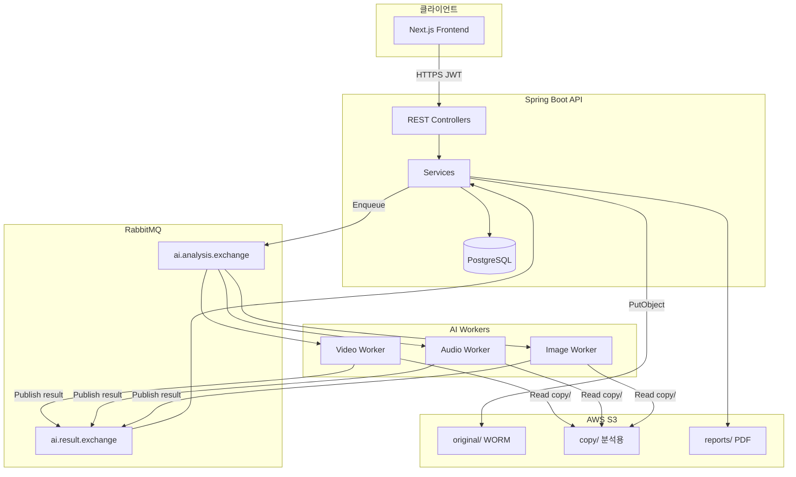

# ForenShield 시스템 개요

> **대상:** FE · BE · AI · INF · AI 에이전트  
> **상위:** [../AGENTS.md](../AGENTS.md)

---

## 1. 비즈니스 목적

내부 수사/검찰 등 **폐쇄망 사용자**가 디지털 **영상** 증거(MP4/MOV)를 업로드하고, **원본 무결성(SHA-256·WORM·CoC)** 을 유지한 채 AI로 딥페이크·변조를 분석하며, 결과를 감사 가능한 형태로 보관·조회하는 플랫폼입니다.

---

## 2. 논리 아키텍처

---

## 3. 핵심 사용자 여정

| 단계 | 사용자 행동 | 시스템 처리 | RQ (예) |
| :---: | :--- | :--- | :--- |
| 1 | 로그인 | JWT 발급 · CoC `LOGIN` | RQ-LOGIN-020 |
| 2 | 증거 업로드 | Validation · SHA-256 · S3 · Evidence row | RQ-REQ-047 |
| 3 | 분석 시작 | AnalysisRequest `QUEUED` · RabbitMQ publish | RQ-REQ-049 |
| 4 | 진행 확인 | polling `analysis-status` 또는 SSE(목표) | — |
| 5 | 결과 조회 | Case/Evidence detail · riskLevel | RQ-DTL-057 |
| 6 | 이력·관리 | MyPage · Admin | RQ-HIS-* · RQ-ADMIN-* |

---

## 4. 데이터 소유권 (Single Source of Truth)

| 데이터 | 정본 위치 | 비고 |
| :--- | :--- | :--- |
| 사용자·권한 | `Users` (DB) | `PENDING` → Admin 승인 후 `APPROVED` |
| 증거 메타 | `Evidences` (DB) | status는 `UPLOADED`/`DELETED`만 |
| 분석 상태 | `AnalysisRequests` (DB) | `QUEUED`→`ANALYZING`→`COMPLETED`/`FAILED` |
| 분석 결과 | `AnalysisResults` + `AnalysisModuleResults` | AI JSON에서 적재 |
| 감사 추적 | `CustodyLogs` (DB) | 해시 체인 · CoC |
| 원본 바이너리 | S3 `original/` | Object Lock · 삭제 불가 |
| AI 입력 파일 | S3 `copy/` | 워커 Read-only |

---

## 5. API 경계

| Base | 용도 |
| :--- | :--- |
| `/api/v1/**` | 표준 REST (신규 API 필수) |
| `/api/auth/login` | Legacy 로그인 (유지) |

**정본:** [../api/specification.md](../api/specification.md)

---

## 6. 비동기 분석 파이프라인

1. BE: `POST /api/v1/evidences/analyze` → `AnalysisRequests` 생성
2. BE: RabbitMQ에 [ai-json.md](../integrations/ai-json.md) Request publish
3. AI: S3 `copy/` 다운로드 → 추론
4. AI: Result JSON → `ai.result.exchange`
5. BE: Consumer → DB 저장 · `COMPLETED` · CoC 기록

**Routing Key:** `analyze.video` · `analyze.audio` · `analyze.image`  
**상세:** [../integrations/rabbitmq.md](../integrations/rabbitmq.md)

---

## 7. 보안·무결성 (요약)

| 요구 | 구현 방향 | RQ |
| :--- | :--- | :--- |
| WORM 원본 | S3 Object Lock Compliance | RQ-SEC-150 |
| CoC 해시 체인 | `CustodyLogs.previousLogHash` | RQ-REQ-051 |
| 블록체인 앵커 | 일 1회 Merkle Root (목표) | RQ-SEC-151 |
| JWT·역할 | `ROLE_USER` / `ROLE_ADMIN` | RQ-NFR-160~162 |

---

## 8. 배포·환경 (개발 기준)

| 구성요소 | 로컬 | 운영 (목표) |
| :--- | :--- | :--- |
| API | `localhost:8080` | EKS + HTTPS |
| DB | PostgreSQL / H2(test) | RDS PostgreSQL |
| Frontend | `localhost:3000` | CloudFront + S3 or Vercel |
| AI Worker | Docker Compose | EKS GPU node pool |
| Message Broker | RabbitMQ Docker | Amazon MQ or self-hosted |

인프라 상세: [../teams/infrastructure.md](../teams/infrastructure.md)

---

## 9. 아직 없는 큰 덩어리 (로드맵)

- PDF 리포트 생성·다운로드 API
- Compare(원본 vs 사본) API
- 알림·사용자 설정 API
- 블록체인 앵커 운영 연동
- 대시보드 7일 트렌드 API (RQ-DSH-044)

→ [../api/specification.md §0.4](../api/specification.md)
