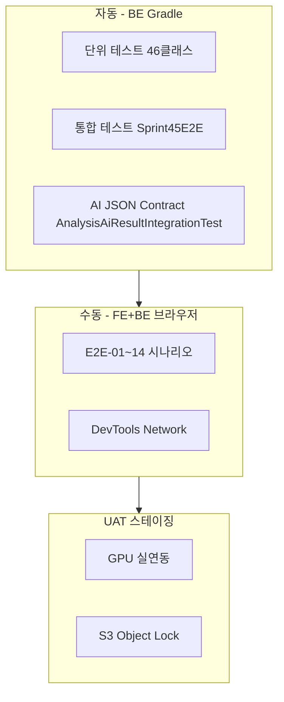

# VeriForensics E2E 테스트 계획 (FE + BE)

> **작성일:** 2026-07-07  
> **범위:** `frontend-deepfake` (Next.js) ↔ `backend-forensic` (Spring Boot)  
> **관련:** [test-matrix-tier1-tier2.md](./test-matrix-tier1-tier2.md) · [api/specification.md](../api/specification.md) · Jira **SK-469** · **SK-1046**

---

## 1. 목적 · 보증 수준

| 항목 | 내용 |
| :--- | :--- |
| **목적** | 사용자 여정(로그인→분석→상세)이 FE 화면과 BE API·DB·CoC까지 **한 번에** 동작하는지 검증 |
| **자동 E2E** | BE: `Sprint45E2EIntegrationTest` 등 (API 단위) |
| **수동 E2E** | 본 문서 시나리오 — **브라우저 + DevTools Network** |
| **보증** | Tier 1 시나리오 Pass = 고객 데모·중간 발표 가능 수준 |
| **비보증** | AI GPU 실연동·S3 WORM·블록체인 http — 스테이징/INF 의존 (별도 UAT) |

---

## 2. 테스트 환경

### 2.1 로컬 연동 (권장)

| 구분 | 설정 |
| :--- | :--- |
| **백엔드** | `cd backend-forensic` → `.\gradlew bootRun` · 포트 `8080` |
| **프론트** | `cd frontend-deepfake` → `npm run dev` · 포트 `3000` |
| **FE env** | `.env.local`: `NEXT_PUBLIC_API_URL=http://localhost:8080` · `NEXT_PUBLIC_USE_MOCK_API=false` |
| **BE 프로필** | `local` (H2) · `analysis.worker.mode=local` (내부 시뮬 분석, ~0.6초) |
| **테스트 계정** | `1111`/`2222` (USER) · `3333`/`4444` (ADMIN) — H2 자동 생성 |

### 2.2 스테이징 (SK-469 · SK-1060)

| 구분 | 설정 |
| :--- | :--- |
| **BE** | `SPRING_PROFILES_ACTIVE=prod` · `ANALYSIS_WORKER_MODE=ai` · RDS·S3·RabbitMQ |
| **FE** | `NEXT_PUBLIC_API_URL={스테이징 BE URL}` |
| **AI** | GPU 워커 → `backend.ai.result.queue` |

### 2.3 검증 도구

- 브라우저 **Network** 탭: API 경로·status·`errorCode`
- BE 로그: `Received AI analysis result` · CoC 기록
- (선택) PostgreSQL/H2: `analysis_requests` · `custody_logs`

---

## 3. FE 라우트 ↔ BE API 매핑

### 3.1 연동 완료 (실 API 호출)

| FE 경로 | FE 모듈 | BE API | RQ |
| :--- | :--- | :--- | :--- |
| `/login` | `lib/auth-api.ts` | `POST /api/auth/login` | LOGIN-020 |
| `/signup` | `lib/signup-api.ts` | `POST /api/v1/auth/signup` 등 | SIGNUP-* |
| `/main` | `lib/evidence-api.ts` | `GET /api/v1/evidences/stats` | DSH-043 |
| `/main` |同上 | `GET .../stats/trend` · `.../stats/recent` | DSH-044~045 |
| `/mypage` | `lib/api/mypage.ts` | `GET /api/v1/mypage/analysis-history` | MY-108, DSH-045 |
| `/cases/[id]` | `lib/api/evidence-detail.ts` | `GET /api/v1/cases?caseKey=` | DTL-053 |
| `/cases/[id]` |同上 | `GET /api/v1/evidences/{id}/detail` | DTL-* |
| `/cases/[id]` | `lib/evidence-api.ts` | `POST .../upload` · `.../analyze` · `.../analysis-status` | REQ-047~049 |
| `/cases/[id]` | `lib/api/case-workflow.ts` | `POST /api/v1/cases` | v2 |
| `/compare` | `lib/api/compare.ts` | `POST /api/v1/compare/verify` · `GET .../{id}` | CMP-093 |
| `/compare/[id]` |同上 | `GET /api/v1/compare/{id}` · PDF download | CMP-104 |
| `/admin/*` | `lib/api/admin.ts` | `/api/v1/admin/**` | ADMIN-* |
| `/mypage/edit` | `lib/api/user.ts` | `GET/PATCH /api/v1/users/me` | MY-110 |

### 3.2 BE 구현 · FE 미연동 (E2E 시 갭)

| BE API | FE 상태 | 비고 |
| :--- | :---: | :--- |
| `GET /api/v1/evidences/{id}/reports/pdf` | ❌ | `metadata-report-tab.tsx` — **mock PDF** (`/mock/report-sample.pdf`) |
| `GET /api/v1/reports` | ❌ | `/reports` 페이지 — **플레이스홀더 UI** |
| `GET/PATCH /api/v1/users/me/settings` | ❌ | `lib/user-settings.ts` — **localStorage** |
| `GET/PATCH /api/v1/notifications` | ❌ | UI 없음 |
| `GET /api/v1/compare/originals` | ❌ | Compare는 **mypage + case detail**로 원본 목록 구성 |
| `PATCH .../exclude` · `replace` · `role` · `representative` | 🟡 | BE ✅ · FE `case-workflow.ts` — mock 외 **throw** (representative만 silent fail) |
| `POST .../access-events` | 🟡 | FE 이벤트: `PRINT_SCREEN` · BE enum: `VIEW` \| `CAPTURE_ATTEMPT` — **계약 불일치** |
| `GET .../dashboard/intro` | ❌ | `/main` — 정적 `trustItems` (API 미호출) |

### 3.3 파일 형식 불일치

| | FE (`case-create-dialog`) | BE (`FileValidationService`) |
| :--- | :--- | :--- |
| 허용 확장자 | mp4, mov, **avi, mkv** | **mp4, mov 만** |

E2E 시 **sample.mp4 / sample.mov** 사용 권장.

---

## 4. E2E 시나리오 (수동 · 브라우저)

> 각 시나리오: **사전조건 → FE 조작 → FE 확인 → Network/BE 확인 → Pass/Fail**

### E2E-01 · 로그인 (일반 사용자)

| 항목 | 내용 |
| :--- | :--- |
| **RQ** | RQ-LOGIN-020, RQ-LOGIN-025 |
| **경로** | `/login` |
| **사전조건** | 로그아웃 상태 |

| 단계 | FE 조작 | FE 기대 | BE/Network 기대 |
| :---: | :--- | :--- | :--- |
| 1 | `1111` / `2222` 로그인 | `/main` 이동 | `POST /api/auth/login` → 200, `token` |
| 2 | — | 헤더에 사용자명 표시 | sessionStorage `accessToken` 저장 |
| 3 | 새 탭에서 `/admin` 접근 | 차단 또는 리다이렉트 | (선택) admin API 403 |

**실패 케이스**

| 조작 | FE 기대 | Network |
| :--- | :--- | :--- |
| 잘못된 비밀번호 | 에러 메시지 | 401 `INVALID_CREDENTIALS` |
| PENDING 계정 | 승인 대기 안내 | 401 `ACCOUNT_PENDING` |

---

### E2E-02 · 로그인 (관리자)

| 항목 | 내용 |
| :--- | :--- |
| **RQ** | RQ-LOGIN-025, RQ-ADMIN-114 |
| **경로** | `/login` → `/admin` |

| 단계 | FE 조작 | FE 기대 | Network |
| :---: | :--- | :--- | :--- |
| 1 | `3333` / `4444` 로그인 | `/admin` 이동 | 200 + `role=ROLE_ADMIN` |
| 2 | `/admin/users` | 사용자 목록 표시 | `GET /api/v1/admin/users` 200, `content[]` |

---

### E2E-03 · 대시보드 통계

| 항목 | 내용 |
| :--- | :--- |
| **RQ** | RQ-DSH-043~045 |
| **경로** | `/main` |

| 단계 | FE 조작 | FE 기대 | Network |
| :---: | :--- | :--- | :--- |
| 1 | 로그인 후 `/main` | 4개 통계 카드 숫자 표시 | `GET .../stats` 200 |
| 2 | — | 7일 추이 차트/목록 | `GET .../stats/trend?days=7` |
| 3 | — | 최근 분석 위젯 | `GET .../stats/recent?limit=5` |

**Pass 기준:** 카드·차트가 로딩 후 에러 없이 표시 (데이터 0이어도 OK).

---

### E2E-04 · 사건 생성 · 증거 업로드 (SK-469 핵심 ①)

| 항목 | 내용 |
| :--- | :--- |
| **RQ** | RQ-REQ-047, v2 사건 |
| **경로** | `/main` → 사건 등록 다이얼로그 → `/cases/[caseId]` |

| 단계 | FE 조작 | FE 기대 | Network / BE |
| :---: | :--- | :--- | :--- |
| 1 | 「사건 등록」·사건명 입력 | — | `POST /api/v1/cases` 200 |
| 2 | MP4 파일 선택·등록 | 사건 상세 이동 | `POST .../upload?caseName=` 200 |
| 3 | — | `evidenceId`·해시 표시 | 응답 `hashValue` 64자 hex |
| 4 | — | 증거 목록에 파일명 | `GET /api/v1/cases?caseKey=` |

**BE 확인:** `custody_logs` — `EVIDENCE_UPLOADED` 등 (H2 콘솔 또는 DB).

---

### E2E-05 · 분석 시작 → 완료 → 상세 (SK-469 핵심 ②)

| 항목 | 내용 |
| :--- | :--- |
| **RQ** | RQ-REQ-049, RQ-DTL-053~057, SK-1060 |
| **경로** | `/cases/[id]` |

| 단계 | FE 조작 | FE 기대 | Network |
| :---: | :--- | :--- | :--- |
| 1 | 「분석 시작」 | 진행 UI 표시 | `POST .../analyze` 200 |
| 2 | 대기 (local ~1초) | progress 증가 | `GET .../analysis-status` polling |
| 3 | 완료 후 | 위험도·요약 탭 | `GET .../detail` 200 |
| 4 | 딥페이크 탭 | moduleResults·차트 | `analysisInfo.riskLevel`, `moduleResults[]` |
| 5 | 무결성 탭 | SHA-256·체인 상태 | `integrityInfo.originalHash` |

**스테이징 추가:** RabbitMQ publish · AI result queue · BE 로그 `Received AI analysis result`.

---

### E2E-06 · 분석 중단

| 항목 | 내용 |
| :--- | :--- |
| **RQ** | — |
| **문서** | [ANALYSIS_CANCEL_FRONTEND_ALIGNMENT.md](../ANALYSIS_CANCEL_FRONTEND_ALIGNMENT.md) |
| **경로** | `/cases/[id]` |

| 단계 | FE 조작 | FE 기대 | Network |
| :---: | :--- | :--- | :--- |
| 1 | 분석 QUEUED/ANALYZING 중 「중단」 | 분석 UI 초기화 | `DELETE .../analysis` **204** |
| 2 | — | 다시 「분석 시작」 가능 | — |

---

### E2E-07 · 마이페이지 분석 이력

| 항목 | 내용 |
| :--- | :--- |
| **RQ** | RQ-MY-108, RQ-DSH-045 |
| **경로** | `/mypage` |

| 단계 | FE 조작 | FE 기대 | Network |
| :---: | :--- | :--- | :--- |
| 1 | E2E-04~05 완료 후 `/mypage` | 사건 카드 목록 | `GET .../mypage/analysis-history` |
| 2 | 사건 클릭 | `/cases/[id]` 이동 | — |
| 3 | 정렬·페이지 변경 | 목록 갱신 | `sort`·`page` query |

---

### E2E-08 · 비교 검증

| 항목 | 내용 |
| :--- | :--- |
| **RQ** | RQ-CMP-091~104 |
| **경로** | `/compare` |

| 단계 | FE 조작 | FE 기대 | Network |
| :---: | :--- | :--- | :--- |
| 1 | 완료된 분석 사건·증거 선택 | 원본 정보 표시 | `analysis-history` + `cases?caseKey=` |
| 2 | 대조 MP4 업로드·검증 | processing → result | `POST /api/v1/compare/verify` 200 |
| 3 | — | 항목별 MATCH/MISMATCH 표 | `items[]`, `verdict` |
| 4 | 결과 페이지 이동 | `/compare/[compareId]` | `GET /api/v1/compare/{id}` |

---

### E2E-09 · 비교 PDF 다운로드

| 항목 | 내용 |
| :--- | :--- |
| **RQ** | RQ-CMP-104 |
| **경로** | `/compare/[compareId]` |

| 단계 | FE 조작 | FE 기대 | Network |
| :---: | :--- | :--- | :--- |
| 1 | PDF 다운로드 클릭 | `.pdf` 파일 저장 | `GET .../compare/{id}/reports/pdf` 200 |
| 2 | — | PDF 열림 | `Content-Type: application/pdf` |

---

### E2E-10 · 분석 PDF (BE only · FE 갭)

| 항목 | 내용 |
| :--- | :--- |
| **RQ** | RQ-DTL-084~087 |
| **상태** | **FE 미연동** — 본 시나리오는 API·Postman으로 검증 |

| 단계 | 조작 | 기대 |
| :---: | :--- | :--- |
| 1 | Bearer token + `GET /api/v1/evidences/{id}/reports/pdf` | PDF 200 |
| 2 | `GET .../reports/verify?reportHash=` | `valid: true` |
| 3 | (FE) `/cases/[id]` 보고서 탭 | 현재 mock PDF만 — **연동 후 E2E-10-FE로 승격** |

---

### E2E-11 · 관리자 · 가입 승인

| 항목 | 내용 |
| :--- | :--- |
| **RQ** | RQ-ADMIN-127~128 |
| **경로** | `/admin/approvals` |

| 단계 | FE 조작 | FE 기대 | Network |
| :---: | :--- | :--- | :--- |
| 1 | admin 로그인 | PENDING 사용자 목록 | `GET /admin/users?status=PENDING` |
| 2 | 승인 클릭 | 상태 변경 | `POST .../approve` 200 |
| 3 | 해당 계정 로그인 | `/main` 진입 | login 200 |

---

### E2E-12 · 관리자 통계 · 로그

| 항목 | 내용 |
| :--- | :--- |
| **RQ** | RQ-ADMIN-120, 150, 137 |
| **경로** | `/admin` · `/admin/statistics` · `/admin/logs` |

| Network 확인 |
| :--- |
| `GET /api/v1/admin/dashboard/stats` |
| `GET /api/v1/admin/dashboard/analysis-stats` |
| `GET /api/v1/admin/logs` · `GET .../logs/export?format=csv` |

---

### E2E-13 · 로그아웃 · 세션

| 항목 | 내용 |
| :--- | :--- |
| **RQ** | RQ-COM-011, RQ-NFR-161 |

| 단계 | FE 조작 | FE 기대 | Network |
| :---: | :--- | :--- | :--- |
| 1 | 로그아웃 | `/login` | `POST /api/auth/logout` (선택) |
| 2 | `/main` 직접 접근 | `/login` 리다이렉트 | API 401 |

---

### E2E-14 · 전체 플로우 (SK-469 · 발표용 1회)

```text
로그인(1111)
  → /main 대시보드 확인
  → 사건 등록 + MP4 업로드
  → 분석 시작
  → analysis-status COMPLETED
  → 사건 상세: 위험도·모듈·무결성 탭
  → /mypage 에 사건 표시
  → /compare 에서 동일 증거로 비교 검증
  → 비교 PDF 다운로드
  → (관리자) 로그·통계 확인
```

**기록:** Jira SK-1046 — 성공/실패 스크린샷 + Network HAR (선택).

---

## 5. E2E 테스트 케이스 표 (실행용)

| E2E-ID | Tier | RQ | FE 경로 | 시나리오 요약 | BE API (핵심) | Expected | Actual | 결과 | 실행자 | 날짜 |
| :--- | :---: | :--- | :--- | :--- | :--- | :--- | :--- | :---: | :--- | :--- |
| E2E-01 | 1 | LOGIN-020 | `/login` | USER 로그인 | `POST /api/auth/login` | `/main` | | | | |
| E2E-02 | 1 | LOGIN-025 | `/login` | ADMIN 로그인 |同上| `/admin` | | | | |
| E2E-03 | 1 | DSH-043 | `/main` | 대시보드 4카드 | `GET .../stats` | 카드 표시 | | | | |
| E2E-04 | 1 | REQ-047 | `/cases/[id]` | 사건+업로드 | `POST /cases`, `POST .../upload` | 상세 이동 | | | | |
| E2E-05 | 1 | REQ-049 | `/cases/[id]` | 분석→상세 | analyze, status, detail | riskLevel 표시 | | | | |
| E2E-06 | 2 | — | `/cases/[id]` | 분석 중단 | `DELETE .../analysis` | 204 | | | | |
| E2E-07 | 1 | MY-108 | `/mypage` | 분석 이력 | `analysis-history` | 사건 목록 | | | | |
| E2E-08 | 2 | CMP-093 | `/compare` | 비교 검증 | `compare/verify` | verdict 표 | | | | |
| E2E-09 | 2 | CMP-104 | `/compare/[id]` | 비교 PDF | compare PDF | 파일 다운 | | | | |
| E2E-10 | 2 | DTL-084 | Postman | 분석 PDF | `evidences/.../pdf` | PDF 200 | | | | |
| E2E-11 | 2 | ADMIN-127 | `/admin/approvals` | 가입 승인 | `admin/users/approve` | APPROVED | | | | |
| E2E-12 | 2 | ADMIN-120 | `/admin` | 관리자 통계 | `admin/dashboard/*` | 차트·숫자 | | | | |
| E2E-13 | 1 | COM-011 | header | 로그아웃 | logout | login 이동 | | | | |
| E2E-14 | 1 | SK-469 | 전체 | E2E 한 바퀴 | (위 복합) | 전 단계 Pass | | | | |

---

## 6. FE·BE 연동 갭 — E2E 전 해결/우회

| # | 갭 | E2E 영향 | 권장 조치 |
| :---: | :--- | :--- | :--- |
| G1 | 분석 PDF FE mock | E2E-10 FE 불가 | Postman으로 BE 검증 · 또는 FE `apiDownload` 연동 |
| G2 | `/reports` 미연동 | 보고서 목록 E2E Skip | BE `GET /api/v1/reports` Postman |
| G3 | 설정 localStorage | 설정 동기화 E2E Skip | 추후 `users/me/settings` 연동 |
| G4 | access-events enum | 400 가능 | FE→`VIEW`/`CAPTURE_ATTEMPT` 정렬 |
| G5 | v2 exclude/replace/role | 사건 편집 E2E Skip | FE `case-workflow.ts` BE 연동 |
| G6 | FE avi/mkvs 허용 | 업로드 400 | E2E는 mp4/mov만 사용 |
| G7 | compare/originals 미사용 | 기능상 문제 없음 | mypage 경로로 검증 |
| G8 | S3 로컬 | 업로드 실패 가능 | AWS 자격증명 또는 스테이징 |

---

## 7. 자동 vs 수동 역할 분담



| 레이어 | 담당 | 산출물 |
| :--- | :--- | :--- |
| BE 자동 | 백엔드 | `.\gradlew test` Pass 로그 |
| FE+BE 수동 | FE+BE | §5 케이스 표 + 스크린샷 |
| UAT | 전체+INF | SK-1046 기록 |

---

## 8. Fail 우선순위 (E2E)

| 등급 | 예시 | 조치 |
| :---: | :--- | :--- |
| **Critical** | E2E-04 업로드 실패, E2E-05 분석 무한 대기 | 배포·데모 중단, 즉시 수정 |
| **High** | detail 필드 누락 (SK-1060) | FE-BE JSON 정렬 (SK-838) |
| **Medium** | PDF·reports FE 갭 | Postman 보완 + 발표 시 한계 명시 |
| **Low** | dashboard/intro 정적 | 문서화만 |

---

## 9. 관련 문서

| 문서 | 용도 |
| :--- | :--- |
| [test-matrix-tier1-tier2.md](./test-matrix-tier1-tier2.md) | BE 단위·통합 TC |
| [api/specification.md §0.7~0.11](../api/specification.md) | FE 연동 API 정본 |
| [teams/frontend.md](../teams/frontend.md) | FE 라우트·인증 |
| [ANALYSIS_CANCEL_FRONTEND_ALIGNMENT.md](../ANALYSIS_CANCEL_FRONTEND_ALIGNMENT.md) | 분석 중단 계약 |
| Jira SK-469 · SK-1046 · SK-1060 | E2E 완료 기준 |
