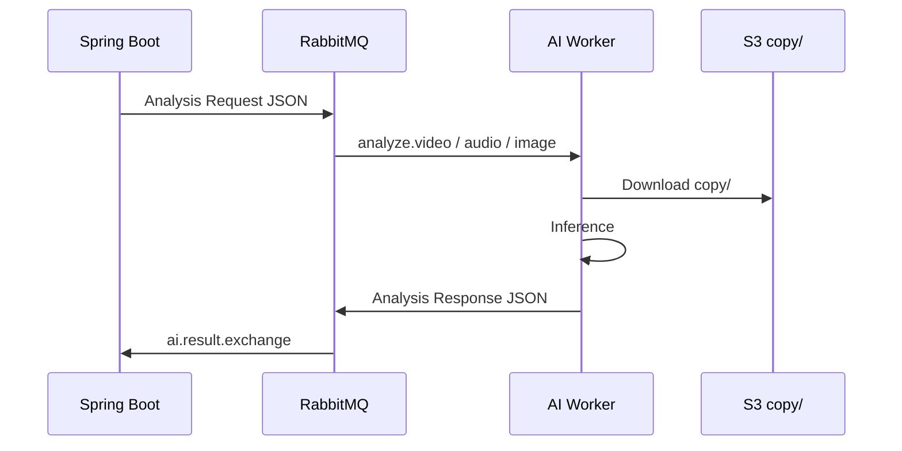

# AI 팀 가이드

> **스택:** FastAPI · Celery Worker · GPU 추론  
> **경로:** `ai/ai-forensic/`  
> **진입:** [../AGENTS.md](../AGENTS.md)

---

## 1. 필독 문서

1. [../integrations/ai-json.md](../integrations/ai-json.md) — **입출력 JSON 정본**
2. [../integrations/rabbitmq.md](../integrations/rabbitmq.md) — Exchange·Queue·Routing
3. [../integrations/s3.md](../integrations/s3.md) — `copy/` Read-only
4. [../architecture/system-overview.md](../architecture/system-overview.md)
5. [../product/domain-glossary.md](../product/domain-glossary.md) — riskLevel · fileType
6. 담당 FN-AI → 기능명세서 Excel AI 시트

---

## 2. 파이프라인 역할

---

## 3. Request (BE → AI)

**Exchange:** `ai.analysis.exchange` (Topic)

| Routing Key | Worker |
| :--- | :--- |
| `analyze.video` | Video |
| `analyze.audio` | Audio |
| `analyze.image` | Image |

**필수 필드:** `analysisId`, `evidenceId`, `fileType`, `filePath`, `originalHash`, `uploadedAt`

→ [ai-json.md §2](../integrations/ai-json.md)

---

## 4. Response (AI → BE)

**Exchange:** `ai.result.exchange`

| status | BE 처리 |
| :--- | :--- |
| `COMPLETED` | AnalysisResults 저장 · status COMPLETED |
| `FAILED` | status FAILED · 사유 message |

**필수:** `riskScore`, `confidenceScore`, `results[]` (모달리티별)

→ [ai-json.md §3~§5](../integrations/ai-json.md)

---

## 5. 규칙 (엄수)

1. **camelCase** 필드명 — snake_case 변경 금지
2. S3 **`original/` 수정·삭제 금지** — `copy/`만 사용
3. 실패 시 `status: FAILED` + 명확한 사유 (stack trace 그대로 X)
4. `prefetch_count=1` — 한 워커당 1 Job ([rabbitmq.md](../integrations/rabbitmq.md))
5. 모델 버전·이름은 Response metadata에 포함 (RQ-DTL-082)

---

## 6. fileType 매핑

| BE Enum | AI JSON |
| :--- | :--- |
| `VIDEO` | `video` |
| `AUDIO` | `audio` |
| `IMAGE` | `image` |

---

## 7. RQ 연계 (AI 담당 예)

| RQ | 내용 |
| :--- | :--- |
| RQ-REQ-049 | 비동기 AI 분석 큐 연동 |
| RQ-DTL-062~066 | 영상 딥페이크·편집 근거 |
| RQ-DTL-063 | Lip-sync |
| RQ-PER-154 | 업로드 즉시 완료·분석 비동기 |

---

## 8. 연구·정확도 문서

모델 성능 개선 노트는 **AI 레포** `ai/ai-forensic/docs/` 등 별도 관리.  
**REST/JSON 계약 변경**은 반드시 BE와 [ai-json.md](../integrations/ai-json.md) 동시 수정.

---

## 9. PR 체크list

- [ ] FN-AI-ID · RQ-ID
- [ ] ai-json.md 예시 JSON 갱신
- [ ] 로컬에서 Request → Response 샘플 검증
- [ ] FAILED 케이스 테스트
